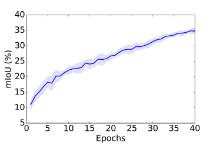
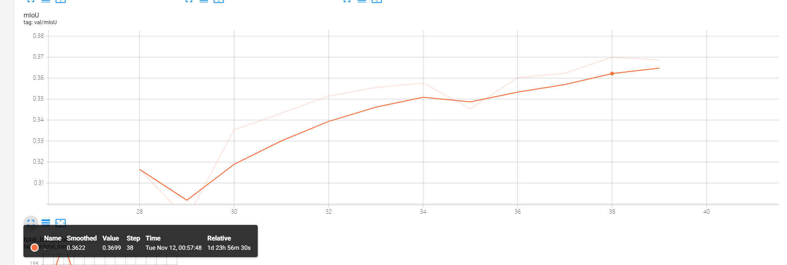

# AutoML for Image Semantic Segmentation
Currently this repo contains a pytorch implementation of [Auto-Deeplab](https://arxiv.org/abs/1901.02985) which **out-performs** that of the original paper. 


Following the popular trend of modern CNN architectures having a two level hierarchy. Auto-Deeplab forms a dual level search space, searching for optimal network and cell architecture.


Auto-Deeplab acheives a better performance while minimizing the size of the final model.


Our results:79.8 miou with Autodeeplab-M, train for 4000epochs and batch_size=16, about 800K iters
<br/><br/>
Our Search implementation currently achieves **BETTER** results than that of the authors in the original AutoDeeplab paper. Awesome!
<br/><br/>
Search results from the auto-deeplab paper which achieve 35% after 40 epochs of searching:    
  
VS our search results which acheive 37% after 40 epochs of searching:    
:  
<br/><br/>

## Training Proceedure

**All together there are 3 stages:**

1. Architecture Search - Here you will train one large relaxed architecture that is meant to represent many discreet smaller architectures woven together.

2. Decode - Once you've finished the architecture search, load your large relaxed architecture and decode it to find your optimal architecture.

3. Re-train - Once you have a decoded and poses a final description of your optimal model, use it to build and train your new optimal model

<br/><br/>

**Hardware Requirement**

* For architecture search, you need at least an 15G GPU, or two 11G gpus(in this way, global pooling in aspp is banned, not recommended)

* For retraining autodeeplab-M or autodeeplab-S, you need at least n more than 11G gpus to re-train with batch size 2n without distributed

* For retraining autodeeplab-L, you need at least n more than 11G gpus to re-train with batch size 2n with distributed
 
 ## Architecture Search


***Begin Architecture Search***

**Start Training**

```
CUDA_VISIBLE_DEVICES=0 python train_autodeeplab.py --dataset cityscapes
```

**Resume Training**

```
CUDA_VISIBLE_DEVICES=0 python train_autodeeplab.py --dataset cityscapes --resume /AutoDeeplabpath/checkpoint.pth.tar
```

## Re-train

***Now that you're done training the search algorithm, it's time to decode the search space and find your new optimal architecture. 
After that just build your new model and begin training it***


**Load and Decode**
```
CUDA_VISIBLE_DEVICES=0 python decode_autodeeplab.py --dataset cityscapes --resume /AutoDeeplabpath/checkpoint.pth.tar
```

## Retrain

**Train without distributed**
```
python train.py
```

**Train with distributed**
```
CUDA_VISIBLE_DEVICES=0,1,2,···,n python -m torch.distributed.launch --nproc_per_node=n train_distributed.py  
```

## Result models

We provided models after search and retrain [[baidu drive (passwd: xm9z)]](https://pan.baidu.com/s/1gt8wnMhqfNOsEVg0gdaWMw) [[google drive]]()

## Requirements

* Pytorch version 1.1

* Python 3

* tensorboardX

* torchvision

* pycocotools

* tqdm

* numpy

* pandas

* apex

## References
[1] : [Auto-DeepLab: Hierarchical Neural Architecture Search for Semantic Image Segmentation](https://arxiv.org/abs/1901.02985)

[2] : [Thanks for jfzhang's deeplab v3+ implemention of pytorch](https://github.com/jfzhang95/pytorch-deeplab-xception)

[3] : [Thanks for MenghaoGuo's autodeeplab model implemention](https://github.com/MenghaoGuo/AutoDeeplab)

[4] : [Thanks for CoinCheung's deeplab v3+ implemention of pytorch](https://github.com/CoinCheung/DeepLab-v3-plus-cityscapes)

[5] : [Thanks for chenxi's deeplab v3 implemention of pytorch](https://github.com/chenxi116/DeepLabv3.pytorch)

## TODO

* Retrain our search model

* adding support for other datasets(e.g. VOC, ADE20K, COCO and so on.)
