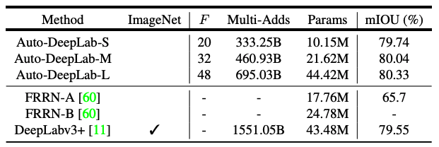
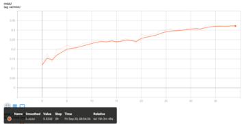

# AutoML for Image Segmentation and Detection
This is an open-source project of AutoML for object detection & segmentation as well as semantic segmentation.

Currently this repo contains a pytorch implementation for [Auto-Deeplab](https://arxiv.org/abs/1901.02985). 


Following the popular trend of modern CNN architectures having a two level hierarchy. Auto-Deeplab forms a dual level search space, searching for optimal network and cell architecture.


Auto-Deeplab acheives a better performance while minimizing the size of the final model.


<br/><br/>
# Architecture Search Performance

From the auto-deeplab paper |  Ours
:---------------------------------------:|:-------------------------:
 | 


***For full-sized model, leave parameters to their default setting***
<br/><br/>
## Training Proceedure

**All together there are 3 stages:**

1. Architecture Search - Here you will train one large relaxed architecture that is meant to represent many discreet smaller architectures woven together.

2. Decode - Once you've finished the architecture search, load your large relaxed architecture and decode it to find your optimal architecture.

3. Re-train - Once you have a decoded and poses a final description of your optimal model, use it to build and train your new optimal model

<br/><br/>

## Architecture Search

***Begin Architecture Search***

**Start Training**
```
CUDA_VISIBLE_DEVICES=0 python train_autodeeplab.py --dataset cityscapes
```

**Resume Training**
```
CUDA_VISIBLE_DEVICES=0 python train_autodeeplab.py --dataset cityscapes --resume /AutoDeeplabpath/checkpoint.pth.tar
```

**Multi-GPU Training**
```
CUDA_VISIBLE_DEVICES=0,1 python train_autodeeplab.py --dataset cityscapes --batch_size 2
```

## Load, Decode and Re-train

***Now that you're done training the search algorithm, it's time to decode the search space and find your new optimal architecture. 
After that just build your new model and begin training it***


**Load and Decode**
```
CUDA_VISIBLE_DEVICES=0 python decode_autodeeplab.py --dataset cityscapes --resume /AutoDeeplabpath/checkpoint.pth.tar
```

**Build and Train new model**
```
CUDA_VISIBLE_DEVICES=0 python train_new_model.py --dataset cityscapes --saved_arch_path /AutoDeeplabpathtosaveddecodings/
```
## Requirements

* Pytorch version 1.1

* Python 3

* tensorboardX

* torchvision

* pycocotools

* tqdm

* numpy

* pandas

## References
[1] : [Auto-DeepLab: Hierarchical Neural Architecture Search for Semantic Image Segmentation](https://arxiv.org/abs/1901.02985)

[2] : [pytorch-deeplab-xception](https://github.com/jfzhang95/pytorch-deeplab-xception)

[3] : [Some code for the project was taken from here](https://github.com/MenghaoGuo/AutoDeeplab)
